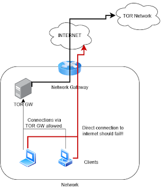

I wanted to build myself a network that didn't look like it was my home network. In particular I wanted it to be able to exit somewhere else rather then my home network. 

<!--more-->

Before this, I had setup a network that used my VPN provider to establish a tunnel under my account to what ever location I wanted to exit from and then the network routed all traffic over the VPN, however I have since stopped using my VPN provider and so was looking for an alternative. 

I decided to look to see if I could do the same with TOR. Here is what the network looks like



There are a few things to point out for this.

- Any computer that directly attempts to access the internet via the Network Gateway should fail, with the exception of the TOR GW. 
- The TOR GW should ONLY be able to access the internet on ports 9001, 9030, 8080, and 53 (DNS) (i.e. on ports necessary for TOR to establish and maintain its connections. 
- The DHCP for the network was configured to have the network Gateway and DNS point to 172.20.0.2  not the network Gateway of 172.20.0.1

And this is the steps I took to build the gateway, I am using Alpine Linux as the base OS. So what isn't covered in this is the setup of the Alpine Linux host (Which is really easy to do)

Once setup, I SSHed to the server to do the configuration. 

First, I installed the packages I would need
```
    apk update
    apk add tor iptables unbound dnsmasq
```

Next, I enabled IP Forwarding on the host
```
    echo "net.ipv4.ip_forward=1" >> /etc/sysctl.conf
    sysctl -p
```

I configured the TOR to be a transparent proxy by editing `/etc/tor/torrc`
```
    RunAsDaemon 1
    Log notice file /var/log/tor/notices.log

    VirtualAddrNetworkIPv4 10.192.0.0/10
    AutomapHostsSuffixes .exit,.onion
    AutomapHostsOnResolve 1

    TransPort 0.0.0.0:9040
    DNSPort 0.0.0.0:5353

    #Prevent exiting on port 80 and 443 (i.e. kill switch if tunnel drops)
    ExitPolicy reject *:80,reject *:443,accept *:*
    
    # Prevent acting as a relay
    ExitRelay 0
    RelayBandwidthRate 0
    RelayBandwidthBurst 0

    # Disable directory service participation
    DirPort 0

    # Optional: disable control port if not needed
    ControlPort 0
```

And configured iptables to do NAT redirection into the proxy
```
    # Flush previous rules
    iptables -F
    iptables -t nat -F

    # Enable NAT
    iptables -t nat -A POSTROUTING -o eth0 -j MASQUERADE

    # Redirect TCP web traffic to Tor
    iptables -t nat -A PREROUTING -i eth0 -p tcp --dport 80 -j REDIRECT --to-ports 9040
    iptables -t nat -A PREROUTING -i eth0 -p tcp --dport 443 -j REDIRECT --to-ports 9040

    # Redirect DNS traffic to Tor’s DNSPort
    iptables -t nat -A PREROUTING -i eth0 -p udp --dport 53 -j REDIRECT --to-ports 5353
```
 
Set the rules to be persistent
```
    apk irc-update add iptables iptables-persistent
    rc-update add iptables
    rc-service iptables save
```

Started the service
```
    rc-update add tor
    service tor start
```
 
Last, I setup Unbound to do caching and forwarding by adding the following to `/etc/unbound/unbound.conf`
```
    server:
    verbosity: 1
    interface: 0.0.0.0
    port: 53
    do-ip4: yes
    access-control: 172.20.0.0/24 allow
    cache-min-ttl: 3600
    cache-max-ttl: 86400
    hide-identity: yes
    hide-version: yes
```

And set the service to start
```
    rc-update add unbound
    service unbound start
```

And that is it, you should have a network that can only access the internet via TOR.