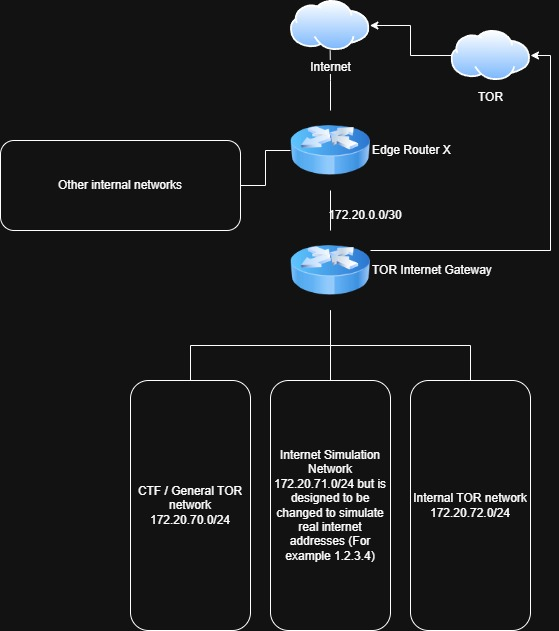

 
[Previously](2025-08-01-setting-up-a-tor-network.md) I built an Alpine-based TOR transparent gateway for a single network that forced all traffic from the network out over TOR. It worked, but it was klunky became: 
 
- It was a weird setup in that it existed in the same network as the actual router. It had a `.2` address and the real router just kinda sat there silenty in the same room with the `.1` address. 
- Because of the way it was setup, it required asymetric routing if I wanted to access things inside the network from outside.
- It was an all or nothing approach (i.e. all traffic from that network exited via TOR)
- It only allowed one subnet.

<!--more-->

 
## The new topology
 
The existing network worked well, however it was time for some improvements to allow me to do some more interesting things on the network, So first, I looked to re-design the network and came up with. 

[](assets/2026-05/new_tor_network.jpg)

The key changes: The TOR GW is now **dual-homed** and has assumed the `.1` address in each of the networks making routing much easier to manage. 

 
## Step 1: The transit subnet
 
First, I reconfigured the ER-X to adjust the `172.20.0.0/24` network to be a `/30`
 
- ER-X side: 172.20.0.1/30
- TOR GW WAN side: 172.20.0.2/30

A /30 gives exactly two usable addresses, which is all a point-to-point link needs.

- Added a route so that all `172.20.0.0/16` traffic was sent to the TOR GW at `172.20.0.2` 

A single /16 summary route covers all three internal subnets (and any future ones) — directly connected routes always win, so the /30 transit doesn't conflict.
 
## Step 2: Change the TOR GW (Alpine) networking

In Proxmox, I added three interfaces all with different vLans to the VM running the gateway. Once added, I adjusted the network to provide each of them an IP address.
 
The TOR GW's `/etc/network/interfaces`:
 
```
auto lo
iface lo inet loopback
 
# WAN Side - Transit link to ER-X
auto eth0
iface eth0 inet static
        address 172.20.0.2/30
        gateway 172.20.0.1
 
# LAN Side - TOR clients General (CTF)
auto eth1
iface eth1 inet static
        address 172.20.70.1/24
 
# LAN Side - iNet representation for CTF
auto eth2
iface eth2 inet static
        address 172.20.71.1/24
 
# LAN Side - Internal TOR network
auto eth3
iface eth3 inet static
        address 172.20.72.1/24
```
 
Only the WAN interface gets a `gateway` line — the LAN interfaces *are* the gateway for their respective segments.
 
## Step 3: Setup DHCP for each of the networks.
 
dnsmasq was already installed (it's in the original setup), so I just had to configure it to serve all three LANs with the right options per-segment:
 
```
# DHCP only - DNS is handled by Unbound (port 53)
interface=eth1
interface=eth2
interface=eth3
bind-dynamic
 
# Disable DNS server (Unbound has port 53)
port=0
 
# eth1 - CTF General
dhcp-range=set:lan0,172.20.70.50,172.20.70.200,255.255.255.0,12h
dhcp-option=tag:lan0,option:router,172.20.70.1
dhcp-option=tag:lan0,option:dns-server,172.20.70.1
 
# eth2 - iNet representation
dhcp-range=set:lan1,172.20.71.100,172.20.71.200,255.255.255.0,12h
dhcp-option=tag:lan1,option:router,172.20.71.1
dhcp-option=tag:lan1,option:dns-server,172.20.71.1
 
# eth3 - Internal TOR network
dhcp-range=set:lan2,172.20.72.100,172.20.72.200,255.255.255.0,4h
dhcp-option=tag:lan2,option:router,172.20.72.1
dhcp-option=tag:lan2,option:dns-server,172.20.72.1
 
dhcp-authoritative
log-dhcp
dhcp-leasefile=/var/lib/misc/dnsmasq.leases
```
 
**Gotcha:** This step required a bit of troubleshooting as I originally used `bind-interfaces`, which requires every listed interface to exist at startup. When eth3 wasn't up (because of the typo above), dnsmasq crashed on launch. Even after fixing the typo, a stale dnsmasq process lingered and blocked the listening sockets. This resulted in me having to `pkill dnsmasq` 
 
## Step 4: DNS that actually works
 
Originally, I made a mistake in the way Unbound was configured. It set up Unbound but never told it where to forward queries. So Unbound would try recursive resolution against root servers, which mostly fails (and would leak DNS outside TOR even if it succeeded).
 
The fix: forward all queries to TOR's DNSPort.
 
`/etc/unbound/unbound.conf`:
 
```
server:
    verbosity: 1
    interface: 0.0.0.0
    port: 53
    do-ip4: yes
    do-not-query-localhost: no
    access-control: 127.0.0.0/8 allow
    access-control: 172.20.70.0/24 allow
    access-control: 172.20.71.0/24 allow
    access-control: 172.20.72.0/24 allow
    cache-min-ttl: 3600
    cache-max-ttl: 86400
    hide-identity: yes
    hide-version: yes
 
forward-zone:
    name: "."
    forward-addr: 127.0.0.1@5353
```
 
## Step 5: Update iptables
 
Once all of the infrastructure was in place, time to update the iptables rules. I wanted to make sure that
 
1. **Bypasses TOR for local-network traffic** — clients can reach other internal LANs and the home LAN normally. This is managed via the Firewall on the ER-X
2. **Redirects all TCP into TOR's TransPort** — not just 80/443. SSH, mail, anything TCP becomes onion-routed.
3. **Redirects all DNS to TOR's DNSPort** — even clients hardcoding 8.8.8.8 get their queries forced through TOR.
4. **Drops any LAN-to-WAN forwarded traffic** — the kill switch. If TOR crashes, nothing leaks.
Key rules (simplified):
 
```bash
# Local bypass (must come first)
iptables -t nat -A PREROUTING -i eth1 -d 172.20.0.0/16 -j ACCEPT
iptables -t nat -A PREROUTING -i eth2 -d 172.20.0.0/16 -j ACCEPT
iptables -t nat -A PREROUTING -i eth3 -d 172.20.0.0/16 -j ACCEPT
 
# Redirect DNS to TOR
iptables -t nat -A PREROUTING -i eth1 -p udp --dport 53 -j REDIRECT --to-ports 5353
# (repeat for eth2, eth3, and TCP DNS)
 
# Redirect all new TCP connections to TOR TransPort
iptables -t nat -A PREROUTING -i eth1 -p tcp --syn -j REDIRECT --to-ports 9040
# (repeat for eth2, eth3)
 
# NAT outbound traffic on WAN
iptables -t nat -A POSTROUTING -o eth0 -j MASQUERADE
 
# Default-drop FORWARD with explicit allows
iptables -P FORWARD DROP
iptables -A FORWARD -m conntrack --ctstate ESTABLISHED,RELATED -j ACCEPT
 
# Allow management networks to reach internal LANs
for net in 10.0.0.0/8 172.16.0.0/12 192.168.0.0/16; do
    iptables -A FORWARD -i eth0 -o eth1 -s $net -j ACCEPT
    iptables -A FORWARD -i eth0 -o eth2 -s $net -j ACCEPT
    iptables -A FORWARD -i eth0 -o eth3 -s $net -j ACCEPT
done
 
# Kill switch: no direct LAN-to-WAN traffic
iptables -A FORWARD -i eth1 -o eth0 -j DROP
iptables -A FORWARD -i eth2 -o eth0 -j DROP
iptables -A FORWARD -i eth3 -o eth0 -j DROP
```
 
The use of `--syn` on the catch-all REDIRECT is important: it only matches new connections (TCP SYN packets). Established connections are tracked by conntrack and don't need to re-traverse PREROUTING.
 
I also allow SSH to the GW itself from any RFC1918 source on the WAN side allowing me to SSH into the router from my internal networks. Again this is now controlled from the ER-X firewall and means I don't need to reconfigure two spots to change my internet networks.
 
```bash
iptables -A INPUT -i eth0 -p tcp --dport 22 -s 10.0.0.0/8 -j ACCEPT
iptables -A INPUT -i eth0 -p tcp --dport 22 -s 172.16.0.0/12 -j ACCEPT
iptables -A INPUT -i eth0 -p tcp --dport 22 -s 192.168.0.0/16 -j ACCEPT
```

This was saved into a script to allow me to rapidly apply these settings. Once run, save the rules with `/etc/init.d/iptables save` and `rc-update add iptables` to persist across reboots.
 
## Step 6: Testing.
 
From a client on any LAN:
 
```bash
ping <gateway>                      # should respond
nslookup google.com                  # should resolve
curl https://check.torproject.org    # should confirm TOR
curl -s https://api.ipify.org        # should return a TOR exit IP
```
 
On the GW, useful debugging commands:
 
```bash
grep -i bootstrap /var/log/tor/notices.log | tail   # is TOR ready?
cat /var/lib/misc/dnsmasq.leases                    # current DHCP leases
iptables -t nat -L PREROUTING -v -n                 # are REDIRECT rules being hit?
tail -f /var/log/messages | grep dnsmasq            # live DHCP activity
dig @127.0.0.1 -p 5353 google.com                   # test TOR's DNSPort directly
```
 
The iptables packet counters (`-v` flag) are particularly useful — if the REDIRECT rule shows 0 packets even when a client is trying to browse, you know traffic isn't reaching the right place.
 
## What's next

In the future, I will likely look to do the following things. 

- Restrict access to the Internal TOR network from the other two. I wanted a network that I can use as a TOR network internally, and not have to worry about what is happening on the other two networks (i.e. that network could have personal devices on it, so I wouldn't want what is happening on one network, to be able to interact with the other.)
- Adjust the "Internet Simulator" network to act as a controlled version of the public internet (or parts of). So it should look and feel like an IP address that I want to simulate. This will allow me to simulate an attacker from a real work IP for CTFs, and provide services to the internal network for things like malware analysis. 
