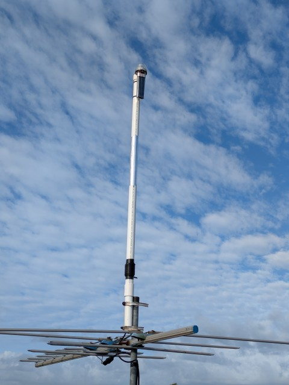
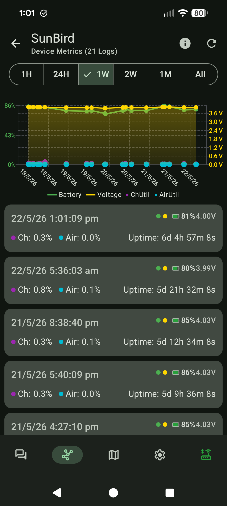

It has been about a week since I have re-built my meshtastic solar node with the Heltec T114. [Solar Node Build](/radio/solar-meshtastic-node.md). Here are the results of how it has performed over the past week, and what I plan to do next. 

<!--more-->

## Placement

At first, I had it attached to some string around a frame in the back yard. This wasn't a great test as it got the sun late in the morning, and then was shaded from the afternoon sun by the house. 
Instead, I got on the roof to attach it to my VHF/UHF flowerpot antenna to give it some height and get maximum sunshine. 

[](assets/2026-05/PXL_20260516_222949910.jpg)

## Battery

On my first build, the ESP32 chip in the Seeed Studio was just too much for the small solar panel in the Solar Bouy. It would just drain the battery, and it might turn on for a few minutes during the day on really sunny days, but not enough to be of any use. 

So with the switch to the T114 which uses nRF52840 chip, the first thing I wanted to see is if it is right-sized for the solar panels. 

Overall, it has performed really well given the weather we have had over the past week. The weather this week has been:

```
- Sunday May 16th - Isolated Showers. 
- Monday May 17th - Cloudy with heavy showers - Lots of rain
- Tuesday May 18th - Overcast with lots of rain
- Wednesday May 19th - Overcast with patchy light rain
- Thursday May 20th - Perfect weather (Sunny)
- Friday May 21st - Perfect weather (Sunny)
```

Despite the terrible conditions for solar, the battery has held really well staying around the same level the whole week. It really only saw maybe a few % movement as you can see.

[](assets/2026-05/Screenshot_20260522-130122.png)

The lowest it got to was 74% @ 5:19am on the 20th, and after two days of sunshine, it has reached back up to 86%. 

> I suspect that the temperature has a part to play as the battery seems to rise in the evening as it cools down. 

## Range

This has probably been the biggest disappointment for the unit. I was hoping to get good coverage from it, but that has not worked out so far. 
To be fair, I live in a dip, and I get good coverage for about 1km distance. This is about the limit of my testing (And the testing has been opportunistic)

It might just work out that it provides good local coverage only, but I will perform some more testing and see. 


## What's next?

I am going to go for a drive to the mountain range behind my place to see if I can contact the node from up there using my portable device. If I can, I will probably look at re-locating it to try and get some good coverage. Alternatively, I have started to look for places higher up that I might be able to place it around me so will see what I come up with.

I have also been looking into what options there are for antenna. The original build had an external one, so might keep investigating what options I have. 