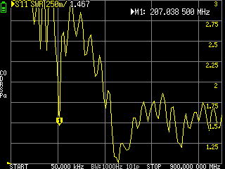
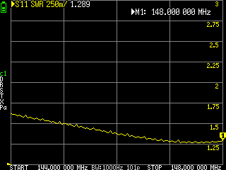
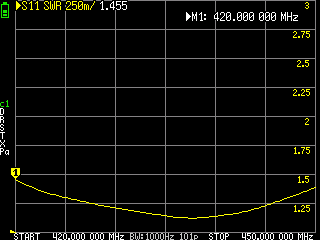

# Overview

A page about my adventures in building various antennas.

## Flowerpot antenna

My first attempt at building an antenna was to build a flower pot antenna. It seemed fairly simple and cheap and so a good place to start. 

### Websites

- [Bundaberg Radio Club Flower Pot Antenna](https://www.barc.asn.au/resources/Antenna_Flower_Pot_2M_70cm_Dual_Band.pdf)
- [Youtube - Build a 2m antenna for $5](https://www.youtube.com/watch?v=4EhUau841jk)

### Shopping list.

| Item | Store | Link | Cost |
|---|---|---|---|
| 1m 25mm PVC Pipe | Bunnings | https://www.bunnings.com.au/holman-25mm-x-1m-class-12-pressure-pvc-pipe_p4770100 | $7.04 |
| 25mm PVC end cap | Bunnings | https://www.bunnings.com.au/holman-25mm-press-pvc-cap-end_p3140471 | $1.30 |
| 25mm PVC Coupling | Bunnings | https://www.bunnings.com.au/holman-25mm-press-pvc-coupling_p3140756 | $1.50 |
| 3m RG58U Coax Cable | Jaycar | https://www.jaycar.com.au/50-ohm-rg58u-coaxial-cable/p/WB2010?srsltid=AfmBOooEum691rqZgpIErWXAzzrGgjprD0PXLGUrb1CVp6SW2UVnP_9t | $4.95 |
| SMA Plug | Jaycar | https://www.jaycar.com.au/gold-sma-crimp-plug-rg58u/p/PP0632 | $5.50 |
| SMA to SMA Adaptor | Jaycar | https://www.jaycar.com.au/sma-socket-to-sma-socket-adaptor/p/PA0635 | $8.85 |
| **Total** |  |  | **$29.15** |

You need about 2.5m of cable for the antenna, so add to that length whatever feedline distance you need. 3m gives you half a meter of feedline.

### Modifications

- I added a 25mm coupling to the bottom of the antenna. This allowed me to mount the antenna to another piece of 25mm pipe which was mounted. Also, the feedline ran through this so it could be protected from the weather. 
- I also opted to add the aluminimum to make it dual band.  

### Tuning

It took me a few attempts to get the antenna right. My first build wasnt trimmed (I didnt have the nanoVNA) and so had a high SWR. 

My second attempt trimmed it to short, I had recieved the nanoVNA, but I tuned it lying down which gave me a different reading when you stand it upright. 

This image, which is a little hard to read, shows a SWR of 1.45 @ 207Mhz, way above my goal of 146Mhz. It did have an OK SWR in UHF.

My third attempt saw success with my results pretty much matching what is in the video. My lowest SWR was @ 138Mhz, so after trimming 22mm of both elements, this is what the results looked like. 

**VHF Results**

**UHF Results**

### Testing and notes.

Even with a high SWR, the antenna outperformed the small antenna on the unit which is to be expected. If I found the right spot around my home, the improvement wasnt by much, but I can now recieve repeaters much further away.

## Slimjim antenna