# Solar Meshtastic Node

I have been playing around with Metastatic lately and have wanted to see if I might be able to build a solar node to help grow the mesh. 

I know you can buy one pre-built, but I have found them to be quite expensive and I wanted to see if I could do it myself. 

## Research.

I started looking around at some ideas on what I could do. I wanted something small and easy to move around and found a link to this website that has used a Solar Buoy to build one. [https://www.instructables.com/Meshtastic-Solar-Buoy/](https://www.instructables.com/Meshtastic-Solar-Buoy/)

So i used that as the basis for my first attempt. 

## Parts List

While I really liked the instructables build, there were a few things that I wanted to see if I could avoid. Mostly they were

1. I didn't want to have to put a hole in the case for the antenna. I want to enhance coverage, and so figured that all I need to do is to be able to place this node on the edge of a location with poor coverage so it can act as a relay. 

2. The RAKWireless boards are awesome but expensive. (For a good reason, they are low power and have the solar controller built in). But I wanted to see if I could do it for less.
 
I spoke to a few people to get some tips and ended up with the following shopping list

- The solar buoy - [AliExpress](https://vi.aliexpress.com/item/1005008556921704.html?spm=a2g0o.order_list.order_list_main.29.65421802m3EzBL&gatewayAdapt=glo2vnm)

The casing, battery and solar panels. All in a neat little package. 

- As ESP32 s3 LORA board - [AliExpress](https://vi.aliexpress.com/item/1005008094638318.html?spm=a2g0o.order_list.order_list_main.17.65421802m3EzBL&gatewayAdapt=glo2vnm)

I needed a small LORA board to fit into the end of the solar node. I have a heltec v3 but there was no way I could fit it into the end. I know that these are a little more power hungry then the Rak Wireless ones, but figured I could test it to see if the battery is enough. 

- Battery Management System boards - [AliExpress](https://vi.aliexpress.com/item/1005005968623999.html?spm=a2g0o.order_list.order_list_main.11.65421802m3EzBL&gatewayAdapt=glo2vnm)

On some advice, I ordered these boards to ensure that the battery provided enough power to the ESP32. Apparently they dont handle low voltage well and figure if this is placed somewhere hard to get to, it is better that it power down and reboot then get stuck and need a manual reboot. 

- MPPT solar controller - [AliExpress](https://vi.aliexpress.com/item/1005005984067122.html?spm=a2g0o.order_list.order_list_main.23.65421802m3EzBL&gatewayAdapt=glo2vnm)

The controller to manage the solar panels and battery charging.

Overall the costs $58.89 including postage and doesnt include the small things like heat shrink tubing, solder etc. 

If you waited for specials you could get all of this a LOT cheaper. 

## Steps

These steps will be pretty similar to the instructables. So on some steps, I wont go into great details because it is on that site. 

### Step 1 
Because I am not using the RAK wireless node, I need a few more components that the Rak does. So I drew myself up a basic circuit diagram of how I would connect everything together. 

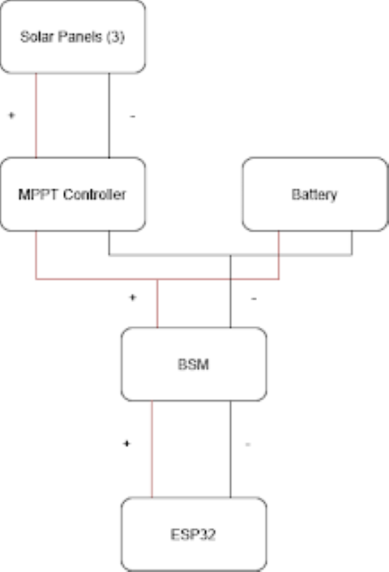

## Step 2 
I followed the instructions on the instructable page to open the Solar Buoy. It took me a few attempts (I was being really cautious not to break anything) but eventually the glue (or whatever the use to seal it) breaks and it unscrews. It also makes a mighty mess, so maybe best done outside. 

I also used this opportunity to clean the thread as much as possible.

[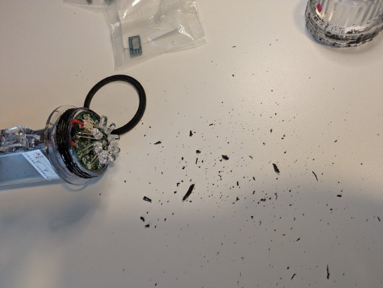](img/PXL_20250620_060228529.jpg)
 
## Step 3
With everything apart, I cut the existing circuit board from the batter and solar panels. I realized pretty quickly that the wires from the solar panel and battery were going to be to big to solder to the controllers, so I tracked down some smaller wire that I could use, and then I would join it to the existing wires. 

I took some time to solder the wires onto each of the boards. First the MPPT controller has two wires that go off to the solar panels, and two that go to the battery.  

[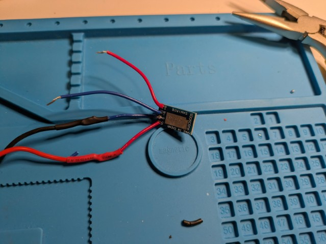](img/PXL_20250620_203444302.jpg)

With the wires soldered on, I then stripped and joined the wires to the solar panel. Once those joins were soldered, I used heat shrink tubing to seal it up nicely.

With the solar panel connected to the MPPT controller, I tested it to see if it was working as I expected. I did this by placing the solar panels under a light on my desk, and then covering them to see if the power dropped. 

[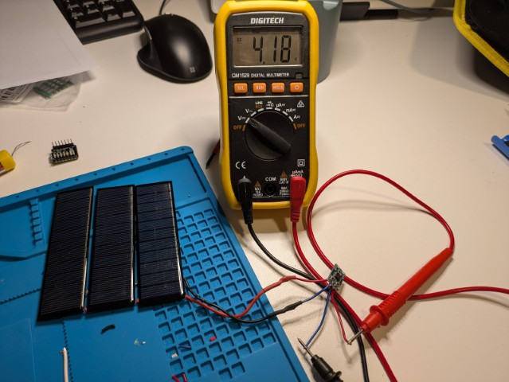](img/PXL_20250620_203624780.jpg)

[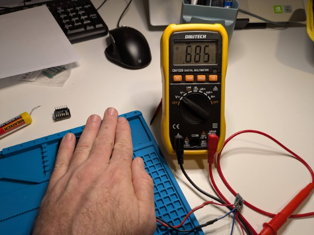](img/PXL_20250620_203650189.jpg)

About 4.18v with the exposed panels, which dropped off to under a volt when covered.  

## Step 4 

Next was the ESP32

[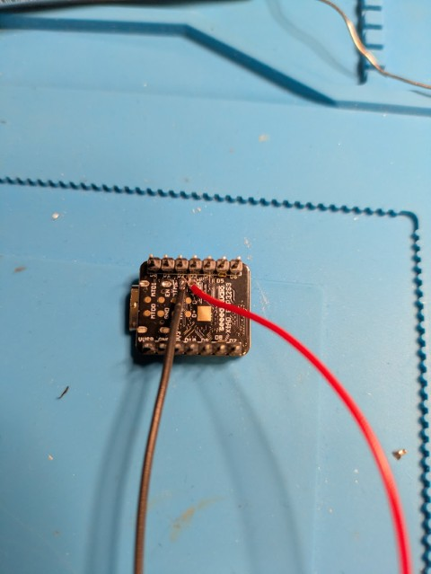](img/PXL_20250620_204448091.jpg)

The pads and connections on these are SMALL, like really small. It took a lot of time to ensure that I didnt get solder all over the board. In future, if I do this again I will look to get a third hand to help hold things in the right place. 
With that finally connected, I connected it to the battery to ensure that everything turned on as expected.

[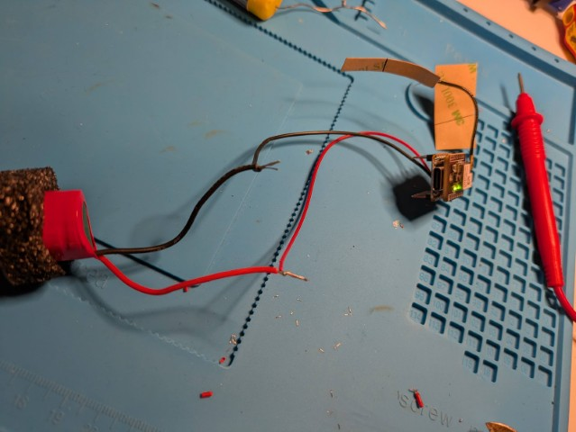](img/PXL_20250620_205353033.jpg)

I got a green light on the meshtastic node, and was able to connect to it via Bluetooth. So that is a good sign.

## Step 5 
Next was to put all of the devices together that were on the battery side of the BMS. I soldered the battery, and the MPPT controller (Battery side) directly to the BMS. 

[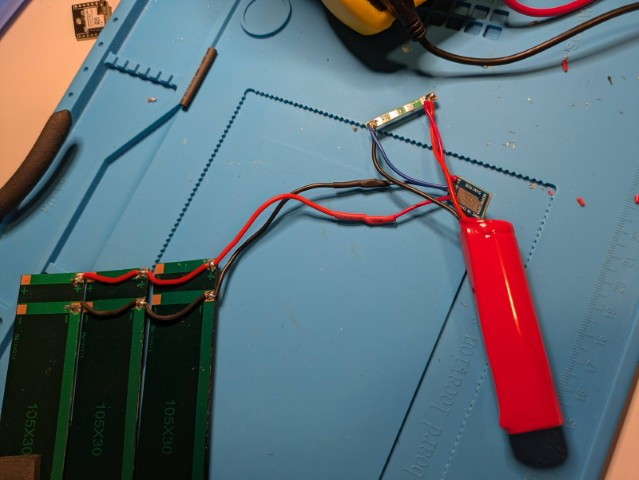](img/PXL_20250620_210154626.jpg)

When I put a multi meter on the load side of the BMS, I was getting about the same voltage as before (around 4v) so that seems like it was working well. 

## Step 6
I then soldered the meshtastic node to the load side of the BMS. 

[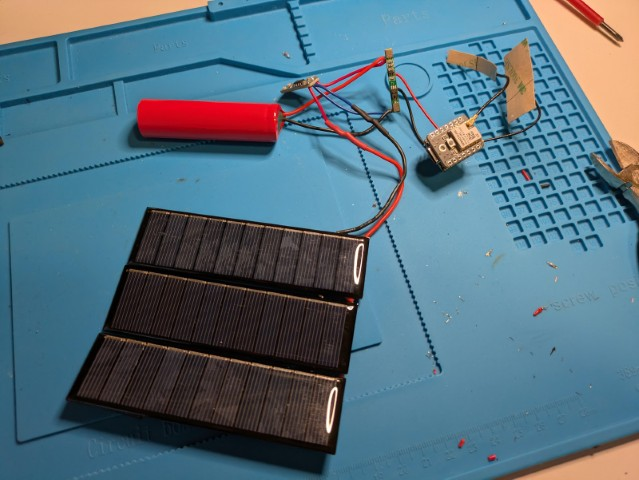](img/PXL_20250620_210504794.jpg)

You cant see it in that photo, but the node is on and the status light is flashing. (my bad photography skills)

## Step 7
With everything working on the bench, it was time to try and put it back into the solar buoy. I kept all of the foam inserts which came in handy as I didn't really want everything moving around inside and possibly shorting out. First the batteries and solar panels

[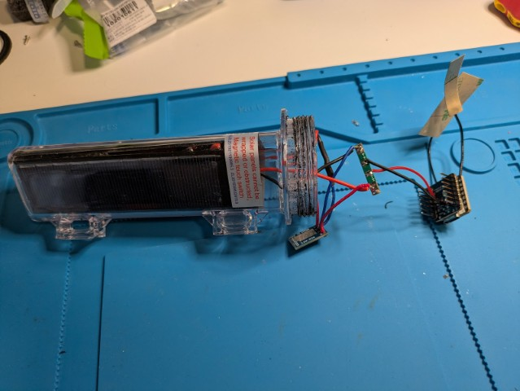](img/PXL_20250620_210659985.jpg)

Next I gently placed the wires back in and placed the MPPT controller on one side (With the LEDs facing outwards so I could see if it was charging) and the BMS on the other side. 

[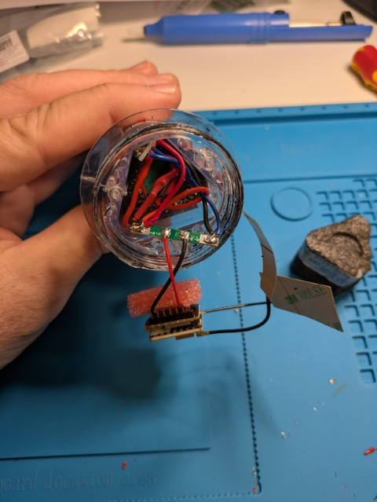](img/PXL_20250620_210829728.jpg)

Finally, I replaced the foam from the top, and used it to stick the pins of the ESP32 into it so it wouldn't move around a lot. 

[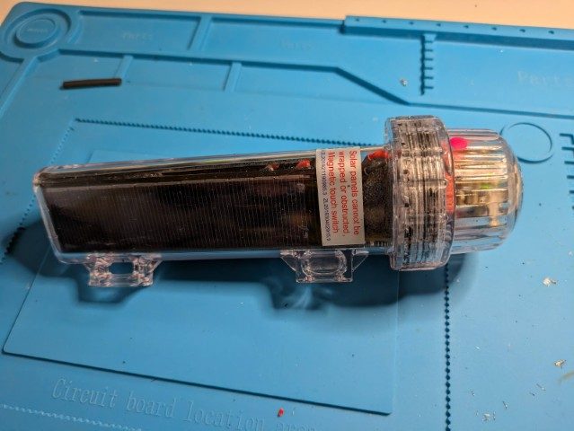](img/PXL_20250620_211109833.jpg)

It is a tight fit, but everything fits in OK, and there is enough room for the antenna in the top. I have heard that the antenna that comes with this board isnt great. So I might replace it in the future. There is enough room for a small antenna in the buoy if this is needed. 

## Step 8
With everything inside, time to put the lid back on. I used Threaded Seal tape on the thread to try and get it as water tight as possible. 

[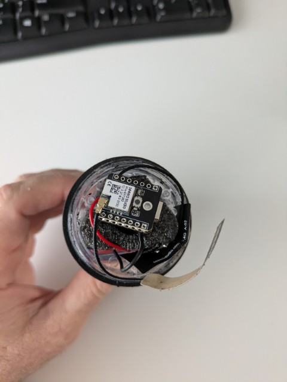](img/PXL_20250620_221846494.jpg)
 
## Testing

With everything back together, I went about testing it. Unfortunately, the battery was pretty flat when I did this, and it was a rainy day so would start up for a bit of time, and then shutdown due to low power (I hope that is what it is). So will placed it outside ready for the next sunny day. 

[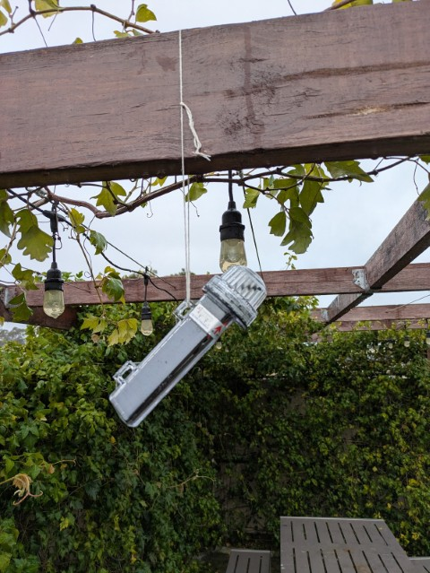](img/PXL_20250621_033930820.jpg)