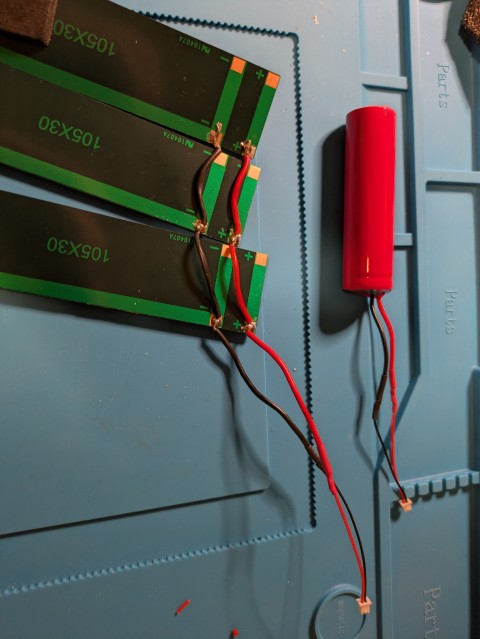
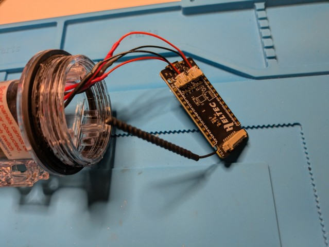
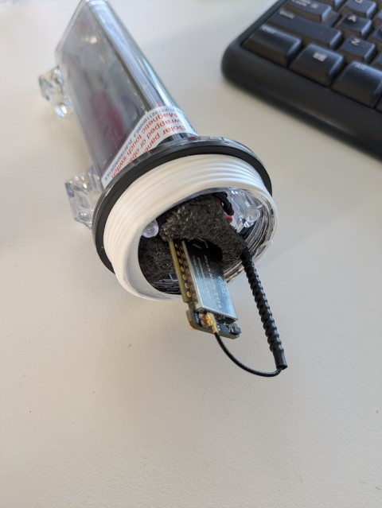

# Solar Meshtastic Node

I have been playing around with Metastatic lately and have wanted to see if I might be able to build a solar node to help grow the mesh. 

I know you can buy one pre-built, but I have found them to be quite expensive and I wanted to see if I could do it myself. 

## Research.

I started looking around at some ideas on what I could do. I wanted something small and easy to move around and found a link to this website that has used a Solar Buoy to build one. [https://www.instructables.com/Meshtastic-Solar-Buoy/](https://www.instructables.com/Meshtastic-Solar-Buoy/)

So i used that as the basis for my first attempt. 

## Parts List

While I really liked the instructables build, there were a few things that I wanted to see if I could avoid. Mostly they were

1. I didn't want to have to put a hole in the case for the antenna. I want to enhance coverage, and so figured that all I need to do is to be able to place this node on the edge of a location with poor coverage so it can act as a relay. 

2. The RAKWireless boards are awesome but expensive. (For a good reason, they are low power and have the solar controller built in). But I wanted to see if I could do it for less.
 
I spoke to a few people to get some tips and ended up with the following shopping list

- The solar buoy - [AliExpress](https://vi.aliexpress.com/item/1005008556921704.html?spm=a2g0o.order_list.order_list_main.29.65421802m3EzBL&gatewayAdapt=glo2vnm)

The casing, battery and solar panels. All in a neat little package. 

- A Heltek T114 V2 Tracker board - [AliExpress](https://www.aliexpress.com/item/1005008926211741.html?spm=a2g0o.order_list.order_list_main.5.77021802X9yFug)

Initially I tried it with the seeed Studio ESP32 LORA boad. It was a great fit, and great price, however it was just to power hungry for such a small solar panel. It also meant that I need to add a solar-controller and battery management board which added to the price and took up space in the bouy.

After some time, I discovered the Heltek T114 board which uses the same processor as the Rak Wisblock and has the solar and battery controller built into the board. This reduced the complexity and freed up space in the bouy. 

Overall the costs were about $55 including postage. This doesnt include things I have at home such as heat shrink tubing, solder etc. 

If you waited for specials you could get all of this a LOT cheaper. 

## Steps

These steps will be pretty similar to the instructables. So on some steps, I wont go into great details because it is on that site. 

## Step 1
I followed the instructions on the instructable page to open the Solar Buoy. It took me a few attempts (I was being really cautious not to break anything) but eventually the glue (or whatever the use to seal it) breaks and it unscrews. It also makes a mighty mess, so maybe best done outside. 

I also used this opportunity to clean the thread as much as possible.

 
## Step 2
With everything apart, I cut the existing circuit board from the battery and solar panels. The T114 comes with two connectors that connect batterys and solar panels to the board. 

The wires from the solar and battery are larger then the leads that connect to the board, so I cut them at a reasonable length, soldered them together and put heat shrink tubing over the connections. 

## Step 3

Once the wires were soldered, it was just a matter of connecting it all up. 

With everything working on the bench, it was time to try and put it back into the solar buoy. I kept all of the foam inserts which came in handy as I didn't really want everything moving around inside and possibly shorting out. First the batteries and solar panels

It is a tight fit, but everything fits in OK, and there is enough room for the antenna in the top. I have heard that the antenna that comes with this board isnt great. So I might replace it in the future. There is enough room for a small antenna in the buoy if this is needed. 

## Step 8
With everything inside, time to put the lid back on. I used Threaded Seal tape on the thread to try and get it as water tight as possible. 

 
## Testing

With the ESP32, unfortunately it never really got started, the battery was pretty flat to start with and it never got enough charge to re-start it. It would power on only during really sunny direct sunlight days, but never enough to charge it up.

With the T114. I have been running it now for 2 days on cloudy days and the battery basically has remained at 84% the whole time, so I will keep monitoring to see how that goes. 

### Solar Testing

> This step wasnt needed in the current build. 

From the original build,  I tested it to see if it was working as I expected. I did this by placing the solar panels under a light on my desk, and then covering them to see if the power dropped. 

About 4.18v with the exposed panels, which dropped off to under a volt when covered. 